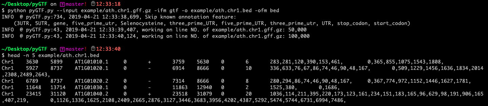
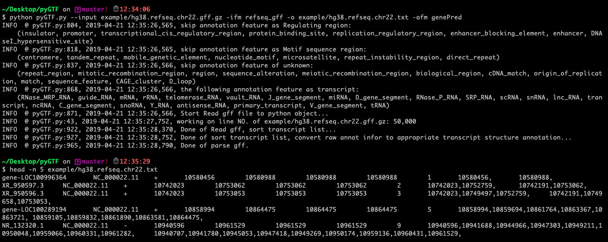
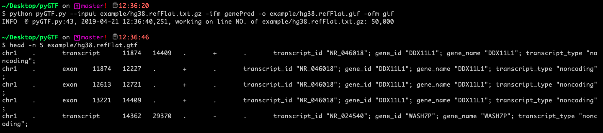
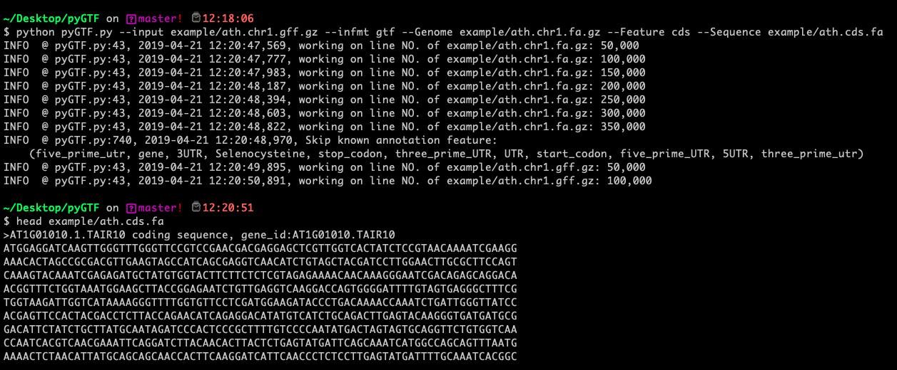
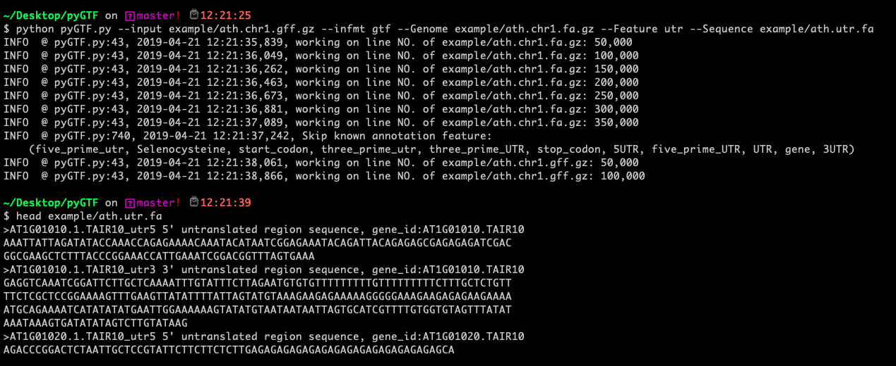
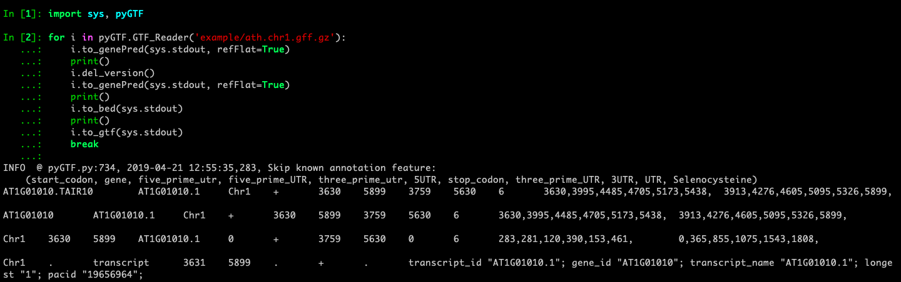
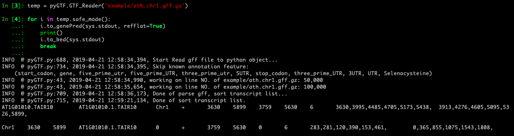
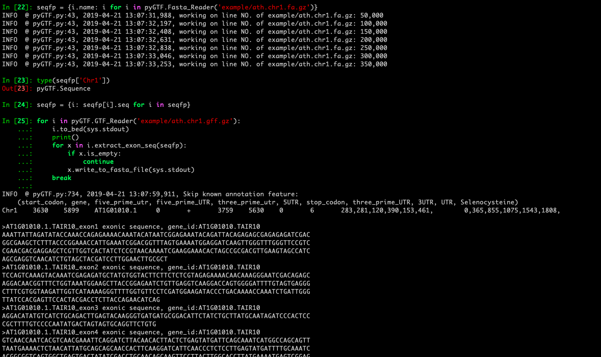

1.  use **pyGTF.py as script** to Convert of Gene annotation format

   **Usage**: python pyGTF.py  --input --infmt --output --outfmt

   - gtf2bed

     

   - refseq_gff2genePred

     

   - genePred2gtf

     

2. use **pyGTF.py as script** to Extract Feature sequence

   **Usage**: python pyGTF --input --infmt --Genome --Feature --Sequence

   - Extract coding sequence

     

   - Extract untranslated region sequence

     

3. use **pyGTF.py as module**

   - GTF_Reader

     

   - safe mode of GTF_Reader 

     

   - Fasta_Reader

     

